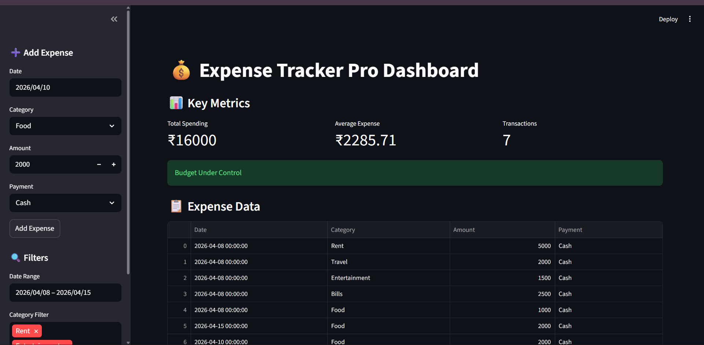
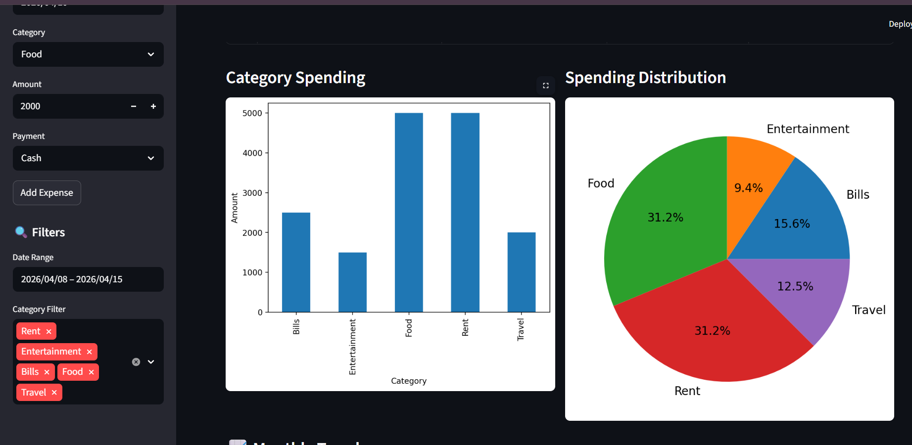
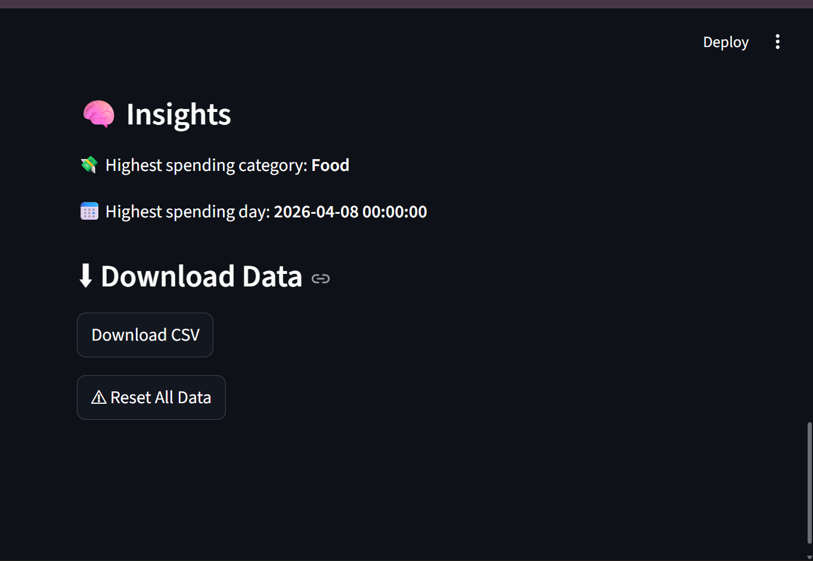

# 💰 Expense Tracker Pro

## 📌 Overview
A data-driven Expense Tracker built using Streamlit that helps users track, analyze, and visualize their spending.

## 🚀 Features
- Add and track daily expenses
- Category-wise analysis
- Monthly spending trends
- Budget alerts
- Download data as CSV
- Interactive dashboard

## 🛠 Tech Stack
- Python
- Streamlit
- Pandas
- Matplotlib

## ▶️ How to Run

```bash
pip install -r requirements.txt
python -m streamlit run app.py


📊 Screenshots

## 📊 Screenshots

### Dashboard


### Graphs


### Insights


📈 Use Case

Useful for:
Personal finance tracking
Budget management
Data analysis practice